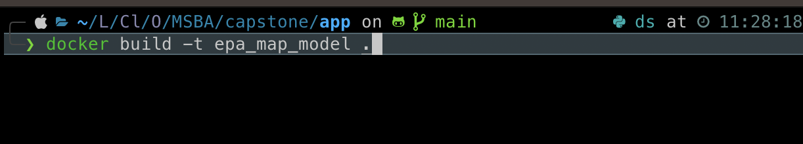
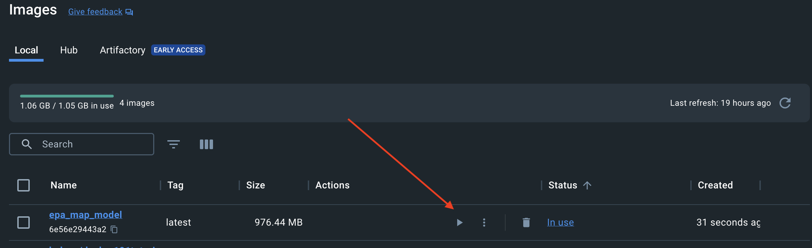
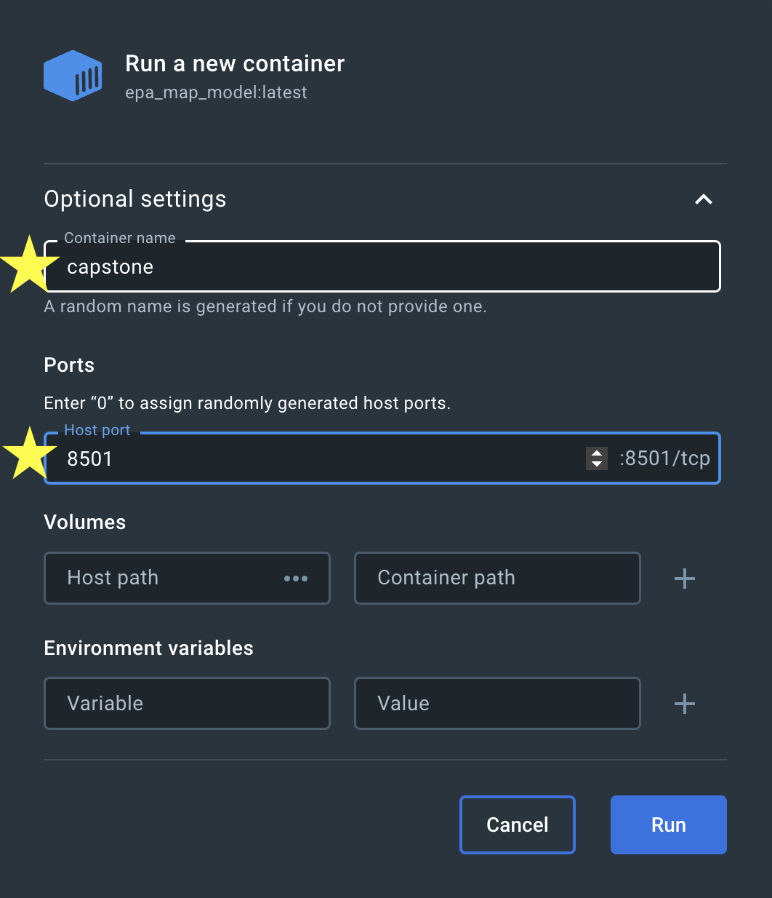
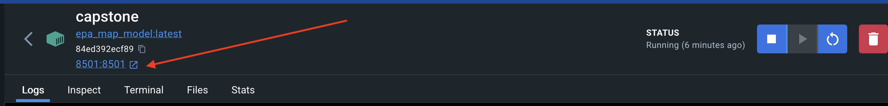
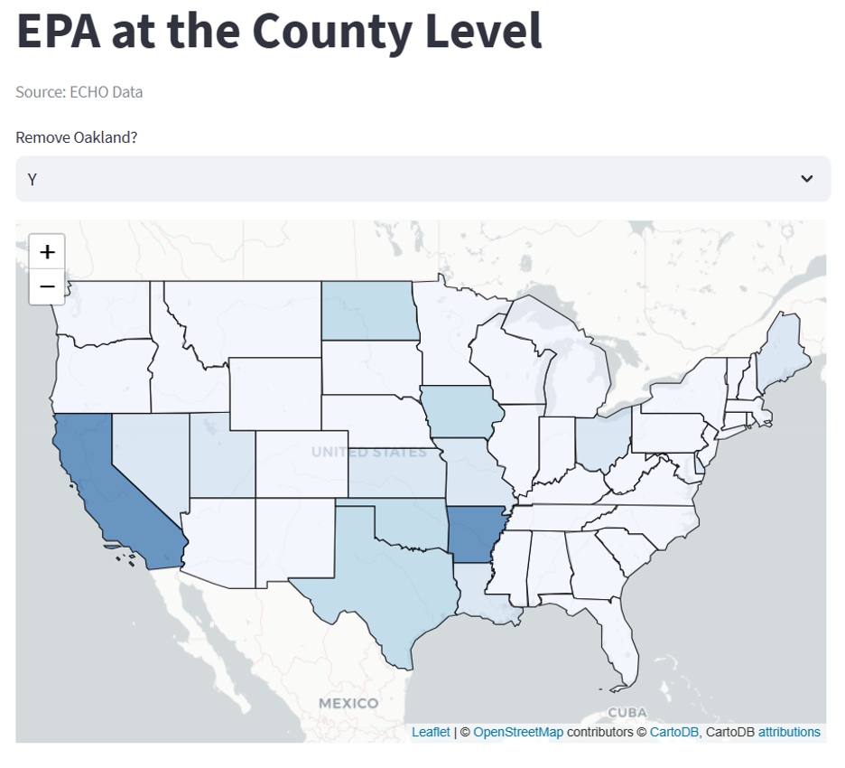
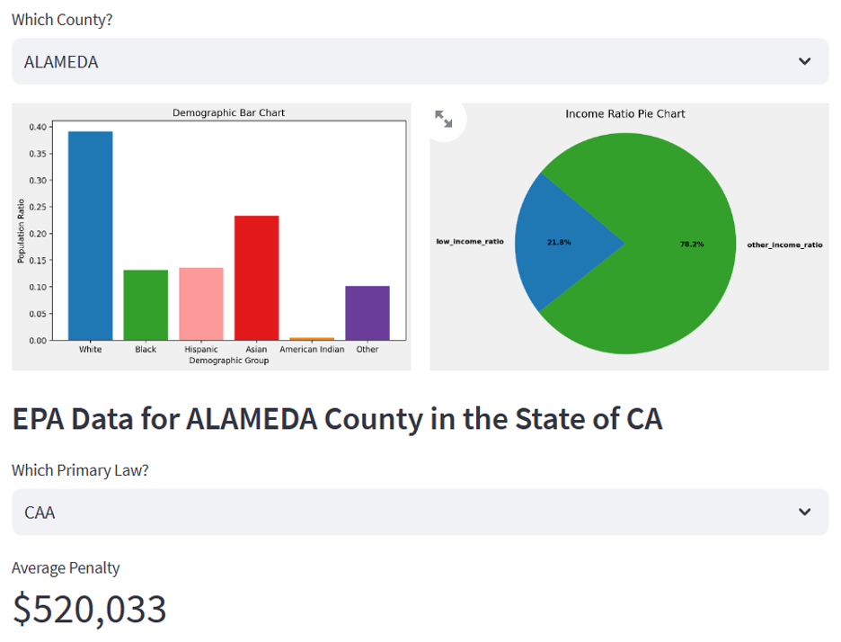
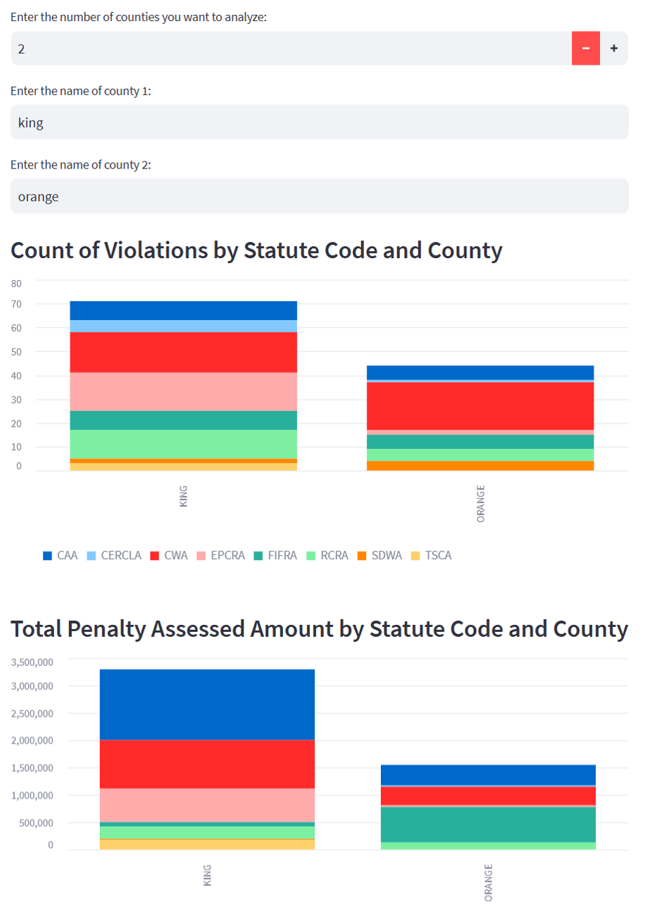
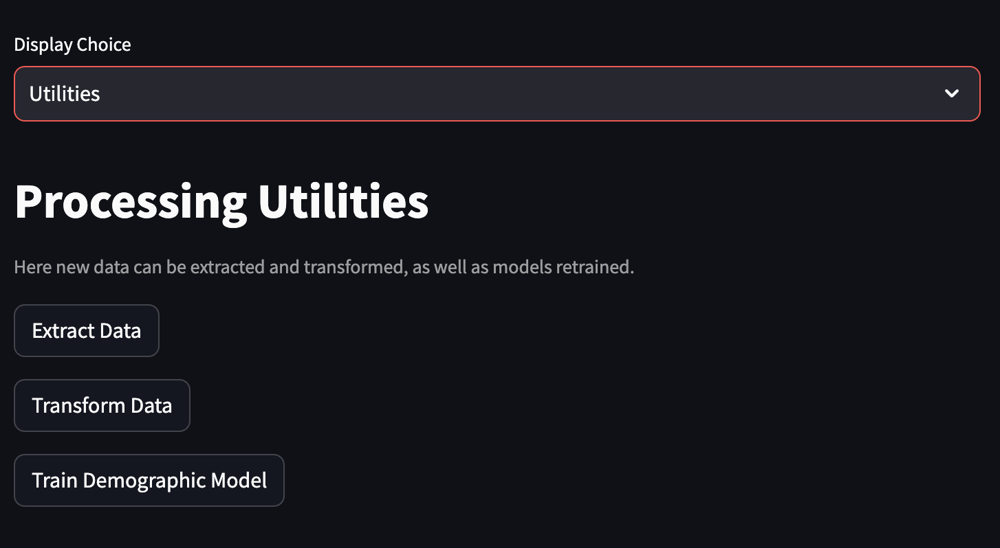

# epa-echo-project

A repo containing a webapp that analyzes the epa echo dataset.

### Setup through Github

1. Clone the repo or download the zip file. Download and install Docker Desktop from https://www.docker.com/products/docker-desktop
   

2. Unzip the application into a folder. Navigate there in command prompt / terminal. Then build the application folder aka run the below command in the folder that contains the DockerFile.

```
docker build -t epa-echo-project .

```



3. Run the image to start the container. Click on the run button on docker desktop.
   

4. Input the proper optional settings.
   

5. Run the container. Click at port to open in web browser.
   

And just like that you have the application up and running in a contained environment.

#### Demographic Analysis Description:

The demographic web app is designed to show the impact of the population on penalty amounts and frequencies.
It is broken into 3 separate sections - the first part uses linear modeling to look at the relationship of penalty amounts and frequencies based on different racial populations. The second section is similar to the first but looks at the ratio of low income households.
Both of these relationships include coefficients to provide the viewer with a better understanding of the trend. The final section is a penalty estimator which is based on a Random Forest model using the State and demographics as features. The user can input values for the location by US State and the demographic distribution to estimate what the EPA federal penalty could be.

#### Images:

Section 1: Penalty Amount and Frequency Relationship by Racial Populations


Section 2: Penalty Amount and Frequency Relationship by Low Income Households


Section 3: EPA Penalty Estimator


#### Geographical Analysis Description:

The geographical analysis web app allows users to visually interpret and interact with geographical, assessed penalty value, penalty count by statue, demographic and income data.

It is broken into 2 separate sections –

The first section allows a user to select a state, county and statute to find an average penalty assessed value by statute chosen. It also produces a visual that shows the demographic race data and income data for the county chosen.

The second section allows the user to view multiple counties by violation count and penalty assessed value. The user selects the number of counties desired to be analyzed, then enter the county names.

#### Images:

Section 1: Penalty Assessed Value Heat Map, Demographic and Income Ratio Data





Section 2: County Violation Count and Penalty Assessed Value Analysis



#### Utilities Description:

There are three buttons here.



The first button is 'Extract Data'. It links to the EPA ECHO website. This is the website where the data was pulled from. This will begin downloading the most up to date data into the /raw/ directory.

The second button is 'Transform Data'. This processes the data so that the models in the application can use it to model. This will create a new file in the /processed/ directory.

Finally there is a button to retrain the demographic model. Note this is usually retrained when the application is opened for the first time. This will create a new file in the /models/ directory.

## Developer Notes

For local testing update local to local paths. `app/` --> `EPA-ECHO-PROJECT/` (or what ever you names the folder locally)

if you need to inspect the container, run in PowerShell:
open interactive terminal `docker exec -it capstone /bin/bash`

if you need to move files arround:
`docker cp container_id:/path/to/container/file_or_directory /path/on/host`

### Recommend work flow for local development

⚠️ Special Note:
`python src/extracting.py` can take upwards of an hr or more to run locally. This depends on personal compute set up and internet speed.
Docker however can get spun up much quicker.

So if you need to get the raw data downloaded locally and quickly do the following:

- open a Powershell terminal
- run `docker exec -it capstone /bin/bash` (assumes you have already spun up the docker container and its running)
- now that you are inside the container run `cd lib/raw/` then `ls` to inspect dirrectory.
- if this is what you want you now know the path and you can just copy it from docker to local.
- back in a bash terminal `docker cp <container_id>:/app/lib/raw ./lib/`
- you will also need to copy the `docker cp <container_id>:/app/lib/us-state-boundaries.geojson ./lib/`

- if select files are not downloading just download manaully and then move into dirrectory.

1. Update the `.env` file (comment out the path you dont need)
   - this determins docker ver local development path
2. run `make install` (assumes you have make installed)
   - this build a venv that mimics your docker environment set up
3. at root `python src/extracting.py` (Downloads Raw Data Locally-- this will take time ~ 1hr)
4. `python src/preprocessing.py` (Process Raw Data)
5. `python src/modeling.py` (Complete Modeling)
6. Make you code changes and test locally.
7. Once happy with changes just revert your selection in the `.env` to select the docker path
8. Deploy container for full test

### Addition of GQIS

#### General steps:

To incorporate interactive mapping with QGIS into your Streamlit web application, you can use the QGIS server to serve your map as a web service. Here are the general steps to achieve this:

1. **Set up QGIS Server**: Make sure you have QGIS Server installed and configured. QGIS Server is a part of QGIS that allows you to publish QGIS projects as web maps.

2. **Create a QGIS Project**: Create a QGIS project (.qgs file) that includes the layers you want to display on the map. You can add your own data layers to this project.

3. **Configure QGIS Server**: Configure QGIS Server to serve your project as a web map. This usually involves setting up a project file (.qgs) and specifying the project's CRS (Coordinate Reference System).

4. **Serve the Map**: Start QGIS Server, and ensure that it is running and serving the map you've configured. You should be able to access the map via a URL.

5. **Integrate with Streamlit**:

   - In your Streamlit application, you can use the `st.iframe` function to embed the QGIS Server URL into your web app. This will display the map as an iframe within your Streamlit app.

   - You can also use Streamlit's `st.write` to display instructions to the user about how to use the map, such as panning, zooming, or interacting with the data layers.

   - If you need to pass data or parameters to QGIS Server to customize the map display (e.g., filter data by certain criteria), you can construct the URL with the necessary parameters and embed it in the iframe.

Here's a simplified example of how you can embed the QGIS map into your Streamlit app using `st.iframe`:

```python
import streamlit as st

# Define the URL of your QGIS Server map service
qgis_map_url = "http://your-qgis-server-url.com/your-map-project"

st.title("Interactive Map with QGIS")

st.write("Use the interactive map to explore the data.")

# Embed the QGIS map using an iframe
st.iframe(qgis_map_url, width=800, height=600)
```

This code will display the QGIS map within your Streamlit app. Users can interact with the map just as they would with a regular web map served by QGIS Server.

Please make sure to replace `"http://your-qgis-server-url.com/your-map-project"` with the actual URL of your QGIS Server map service. Additionally, ensure that QGIS Server is properly configured to serve your map.

By following these steps, you can incorporate interactive mapping with QGIS into your Streamlit application, allowing users to visualize and interact with geographical data alongside the existing features of your web app.

## QGIS

[Sample Data](https://github.com/qgis/QGIS-Sample-Data/tree/master)
[Code Examples/ Old Version ⚠️](https://github.com/qgis/QGIS-Code-Examples)
[Full GQIS Repo](https://github.com/qgis/QGIS-Documentation)
[Google Earth ex](https://github.com/giswqs/qgis-earthengine-examples) :warning: Requires gcloud account

## Foluom Earth

[Notebook](https://github.com/giswqs/qgis-earthengine-examples/blob/master/Folium/ee-api-folium-setup.ipynb)

## LeafMap

[Repo & Examples](https://github.com/opengeos/leafmap/blob/master/README.md)

# TODO

Set limititation of CPU utilization for docker container. Using 100% of CPU and crashing conmputer
