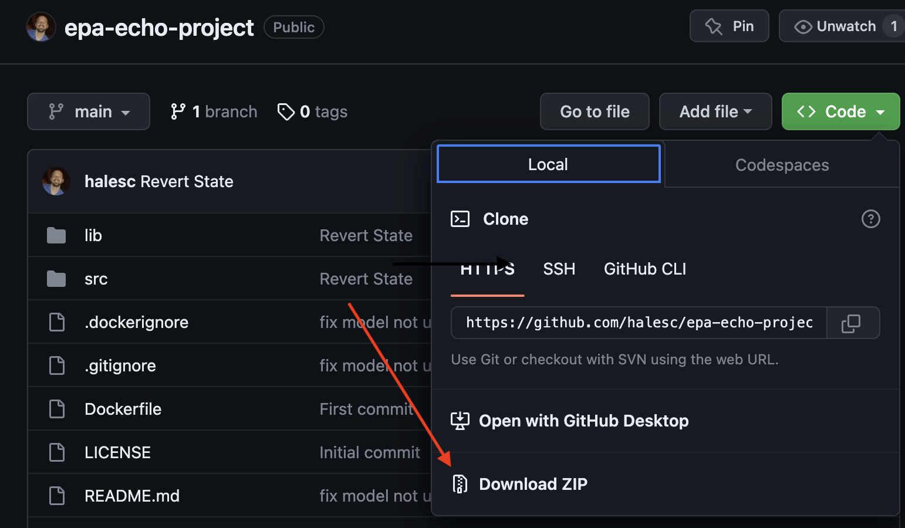

# epa-echo-project
A repo containing a webapp that analyzes the epa echo dataset.

### Setup through Github
1. Clone the repo or download the zip file. Download and install Docker Desktop from https://www.docker.com/products/docker-desktop

## Options
The EPA capstone for the Fall 2023 team worked on improving the interactive maping and data discovery ability via a UI. This can be seem as an add on to the prior teams work.
That being said much of the existing code base is the same as we didnt not want to remove the existing code and docker deployment options. 

This means that you can do both the following:
- continue to sue the existing `docker + streamlit` product if you wish
- and or the new tableau packaged work book. 

if you want to run the streamlit application:
- run `export DEV_PATH="app"` in your terminal (docker path)

if you plan to refesh the tableau workbook:
- run `export DEV_PATH="epa-echo-project"` (local dir path )

### How to use Tableau
- Download Tableau packaged work book. (Here)
- Open Localy (assumes that you have a Tableau Desk Top Account)
- Now you should be able to use the product locally. 

To Share with users who do not have tableau desktop
- Recommend publishing this dashboard to beoing internal Tableua Server and grant users appropriate access.  

### How to refresh data in Tableau locally
To refresh the data thats used in the work book you need one person who has Python downloaded. 
At the root of this directory youll need to run the following. (assumes you can run python)

Assumes you ran `export DEV_PATH="epa-echo-project"` above ⚠️

1. `which make` (this should show you a path to Make) 
    - if you dont get a path run `sudo install make` then try the last line again
2. `make install` (this will install you vertual environment as .venv)
    - Note MAKE requires Ubuntu or WSL. If you dont have that you can use the following in bash terminal instead. 
        - `python -m venv .venv` (make venv)
        - `source .venv/bin/activate` (jump into venv)
        - `pip install -r requirements.txt` install each of the packages in the requierments.txt
    - These are the same steps execute in the MakeFile FYI.. 
3. `source .venv/bin/activate` this will set your machine to use the vertual environment we just created. 
4. `python src/extracting.py` (Extract Raw Data From EPA ECHO -- This will take a bit)
5. `python src/preprocessing.py` (Proccess Data and join it all together)
6. `python src/modeling.py` (Cretes the data model as well as the preped data for tableau to use) "models/tidy_data_with_predictions.csv"

Now all you need to do is replace the existing `tidy_data_with_predictions.csv` file in tableau with the updated version and the tableua workbook will update everything!

Recommendation:
My guess is that Boeing uses Tabelau for Dashboarding and Snowflake for Data Warehousing. 
I would reccomend writing this data to a snowflake table and having the tableau workbook link to that data source.
That way when you refresh your workbook you can simply:
- generate the data again with the steps above
- truncate the target data in snowflake
- then just insert the updated records from the new file produced
- This will allow for a more semless update proccess for your end users

### Why Tableau
The UI selected for best perfromace and interactivity was Tableau. This was compaired against other tools and maping softwears such as 'dask', 'folium', 'pyplot', 'streamlit', etc.

Each of these tools worked for basic interactions and basic visulizations, but at the end of the day each fell victom to the same issues:
- Complex
- High code requirerments
- No compute or data cashe help
- could only use ~10% of the over all data before latency was an issue.
- 10k + lines of HTML 😟

Ultimatly Tableau was selected as to best choice do to it simple user interface, its powerfull sql engine and pre computation that can assist with data size limitations. 
Additionaly tableau offers a high level of customization, flexability, and interactions. 
Lastly Tableau allows us to save a packaged workbook for hand off to the client. 

This minimizes the technical requirments of end product users. 
The Only real down side of tableau is that its not source controled. 

### Future implementatons
The future goal of this project is for Boeing to take this packaged work book + the code generation proccess and deploy this dashboard on Boeings Tableau Servers. 
This will allow for a secure and distributable dashboard that's simple and easy for nontechnical users to use. 

Data Generation will occure periodically by running the python scripts provided and inserting the records into snowflake